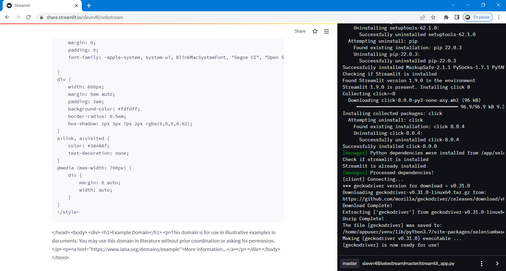

# 🏠 Selestream [](https://share.streamlit.io/slevin48/selestream) 
Selenium web scraping on streamlit cloud

https://discuss.streamlit.io/t/selenium-web-scraping-on-streamlit-cloud/21820/6



minimal example of running Selenium on Streamlit Cloud:
```python
import streamlit as st
import os, sys

@st.experimental_singleton
def installff():
  os.system('sbase install geckodriver')
  os.system('ln -s /home/appuser/venv/lib/python3.7/site-packages/seleniumbase/drivers/geckodriver /home/appuser/venv/bin/geckodriver')

_ = installff()
from selenium import webdriver
from selenium.webdriver import FirefoxOptions
opts = FirefoxOptions()
opts.add_argument("--headless")
browser = webdriver.Firefox(options=opts)

browser.get('http://example.com')
st.write(browser.page_source)
```

The only Python requirement is installing `seleniumbase`; the only package required for `packages.txt` is `firefox-esr`.

If you absolutely have to use Chrome, you should be able to specify chrome in the sbase... line, and instead of firefox-esr, you can install chromium.